# Nginx Infrastructure as Code mit Terraform

Dieses Projekt erstellt eine Nginx-Container-Infrastruktur mit Terraform und Docker und demonstriert sowohl lokalen als auch Remote State mit Azure Storage.

## Übersicht

Das Projekt nutzt Terraform, um einen Nginx-Container auf Port 8080 zu deployen. Es demonstriert verschiedene Terraform-Konzepte:

- **Provider**: Kreuzwerker Docker Provider
- **Module**: Wiederverwendbare Nginx-Container-Konfiguration
- **Variables**: Konfigurierbare Parameter
- **Outputs**: Wichtige Infrastrukturdaten
- **Locals**: Interne Werte und Berechnungen
- **Remote State**: Azure Storage Backend für Team-Collaboration

## Projekt-Struktur

```
nginx-iac/
├── main.tf                    # Haupt-Terraform-Konfiguration
├── backend.tf                 # Remote State Backend-Konfiguration
├── variables.tf               # Input-Variablen
├── outputs.tf                 # Output-Definitionen
├── locals.tf                  # Lokale Werte
├── modules/
│   └── nginx_container/
│       ├── main.tf           # Container-Ressourcen
│       ├── variables.tf      # Modul-Variablen
│       └── outputs.tf        # Modul-Outputs
├── screenshots/              # Dokumentations-Screenshots
│   └── remote-state/         # Azure Remote State Screenshots
├── .gitignore                # Git-Ignore-Regeln
└── README.md                 # Diese Datei
```

## Voraussetzungen

- [Terraform](https://www.terraform.io/downloads) >= 1.0
- [Docker Desktop](https://www.docker.com/products/docker-desktop) (läuft)
- [Azure CLI](https://docs.microsoft.com/en-us/cli/azure/install-azure-cli) (optional)
- Git für Versionskontrolle
- Azure Storage Account für Remote State

## Schnellstart

### 1. Repository klonen

```bash
git clone <your-repo-url>
cd nginx-iac
```

### 2. Backend-Konfiguration anpassen

Erstellen Sie eine [`backend.tf`](backend.tf) basierend auf Ihrem Azure Storage:

```hcl
terraform {
  backend "azurerm" {
    resource_group_name  = "rg-terraform-state"
    storage_account_name = "IHR_STORAGE_ACCOUNT"
    container_name       = "tfstate"
    key                  = "nginx-iac.tfstate"
    access_key          = "IHR_ACCESS_KEY"
  }
}
```

### 3. Terraform initialisieren

```bash
terraform init
```

### 4. Konfiguration validieren

```bash
terraform fmt -recursive
terraform validate
```

### 5. Plan erstellen

```bash
terraform plan
```

### 6. Infrastruktur deployen

```bash
terraform apply
```

### 7. Nginx testen

Nach erfolgreichem Deployment:

- Öffnen Sie http://localhost:8080
- Oder testen Sie mit: `curl http://localhost:8080`

### 8. Aufräumen

```bash
terraform destroy
```

## Variablen

| Variable         | Beschreibung              | Standard           | Typ    |
| ---------------- | ------------------------- | ------------------ | ------ |
| `container_name` | Name des Nginx-Containers | `nginx-updated-tf` | string |
| `image_name`     | Docker-Image für Nginx    | `nginx:latest`     | string |
| `external_port`  | Externer Port für HTTP    | `8080`             | number |

### Eigene Werte setzen

Erstellen Sie eine `terraform.tfvars` Datei:

```hcl
container_name = "mein-nginx"
external_port  = 9000
```

## Outputs

Das Projekt gibt folgende Werte aus:

- `nginx_url`: URL zum Zugriff auf Nginx
- `container_id`: ID des erstellten Containers

## Lokaler State - Vollständige Workflow-Dokumentation

### Terraform Formatierung und Validierung

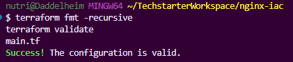
_Code-Formatierung und Validierung_

### 1. Terraform Plan (Erstellung)

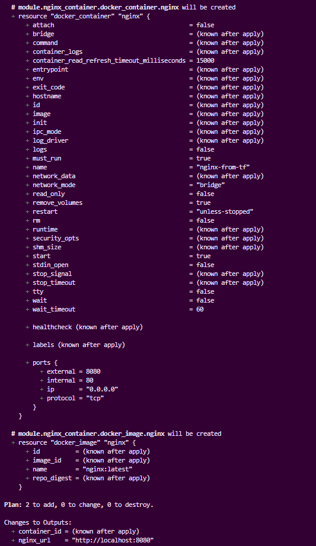
_Plan zeigt neue Ressourcen mit `+` Symbolen_

### 2. Terraform Apply (Erstellung)

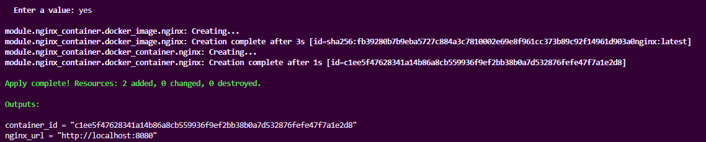
_Erfolgreiche Ressourcen-Erstellung mit Outputs_

### 3. Infrastruktur-Verifikation

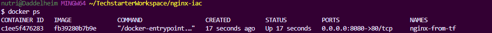
_Docker Container läuft erfolgreich_

### 4. Nginx Funktionstest

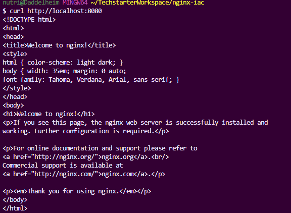
_Nginx antwortet erfolgreich auf Port 8001_

### 5. Terraform Plan (Update)

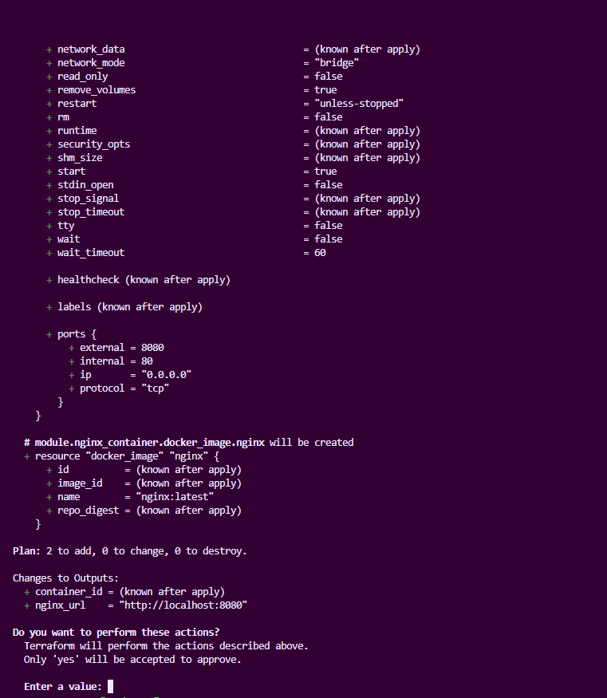
_Plan zeigt Änderungen mit `~` Symbolen_

### 6. Terraform Apply (Update)


_Erfolgreiche Ressourcen-Aktualisierung_

### 7. Terraform Destroy

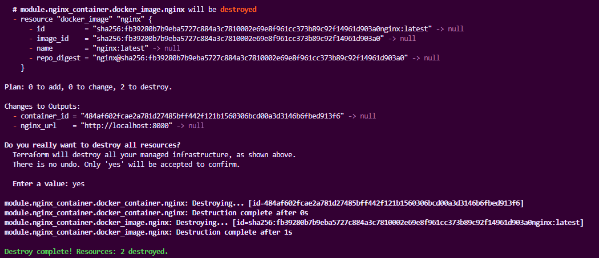
_Vollständige Infrastruktur-Zerstörung_

## Azure Remote State Configuration

### Warum Remote State?

Remote State ist essentiell für professionelle Terraform-Nutzung:

- **Team-Zusammenarbeit**: Geteilter State für mehrere Entwickler
- **Sicherheit**: State-Datei sicher in der Cloud gespeichert
- **Versionierung**: Azure Storage bietet automatische Versionierung
- **Robustheit**: Schutz vor lokalem Datenverlust
- **Concurrency**: Verhindert gleichzeitige Änderungen durch mehrere Benutzer
- **Konsistenz**: Einheitlicher State für alle Team-Mitglieder

### Azure Storage Backend Setup

#### 1. Azure-Infrastruktur vorbereiten

```bash
# Resource Group erstellen
az group create --name "rg-terraform-state" --location "West Europe"

# Storage Account erstellen
az storage account create \
  --name "blobvomob" \
  --resource-group "rg-terraform-state" \
  --location "West Europe" \
  --sku "Standard_LRS"

# Container erstellen
az storage container create \
  --name "tfstate" \
  --account-name "blobvomob"
```

#### 2. Backend-Konfiguration

Die [`backend.tf`](backend.tf) definiert wo der Terraform State gespeichert wird:

```hcl
terraform {
  backend "azurerm" {
    resource_group_name  = "rg-terraform-state"  # Azure Resource Group
    storage_account_name = "blobvomob"           # Storage Account Name
    container_name       = "tfstate"             # Blob Container
    key                  = "nginx-iac.tfstate"   # State-Datei-Name
    access_key          = "ACCESS_KEY"           # Authentifizierung
  }
}
```

**Wichtige Backend-Parameter:**

- `resource_group_name`: Azure Resource Group die das Storage Account enthält
- `storage_account_name`: Name des Azure Storage Accounts
- `container_name`: Blob Container für State-Dateien
- `key`: Eindeutiger Name der State-Datei im Container
- `access_key`: Storage Account Access Key für Authentifizierung

### Remote State Migration und Workflow

#### 1. Migration zum Remote Backend

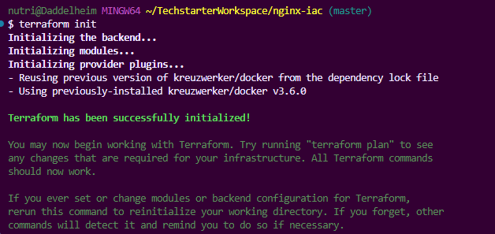
_Terraform erkennt das neue Backend automatisch und bietet State-Migration an. Nach Bestätigung mit 'yes' wird der lokale State ins Azure Storage übertragen._

#### 2. Remote State Verification

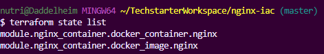
_Erfolgreiche Verbindung zum Remote State. Terraform liest alle Ressourcen aus dem Azure Storage Backend._

#### 3. Terraform Plan mit Remote State

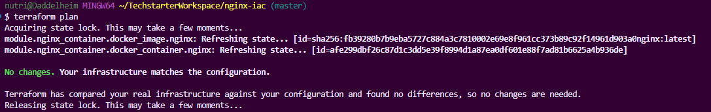
_Plan-Operation nutzt den Remote State aus Azure. Terraform zeigt dass keine Änderungen erforderlich sind._

#### 4. Azure Storage Container

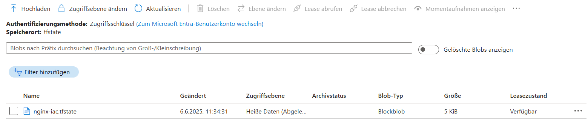
_Der Azure Storage Container 'tfstate' im Portal. Hier wird die Terraform State-Datei sicher gespeichert und ist für das gesamte Team zugänglich._

#### 5. Remote State File

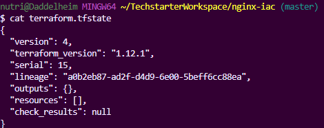
_Die State-Datei 'nginx-iac.tfstate' ist erfolgreich in Azure Storage gespeichert. Sie enthält den kompletten Zustand der Infrastruktur._

#### 6. Infrastructure Deployment mit Remote State

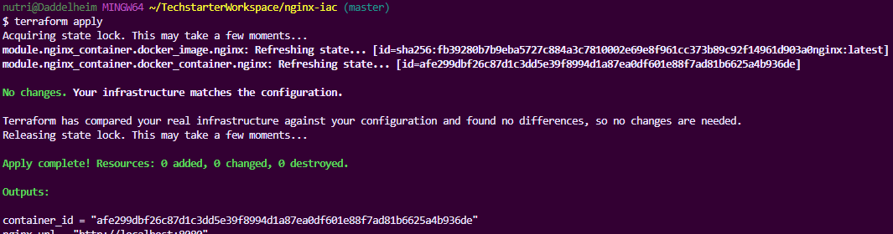
_Erfolgreiche Infrastruktur-Erstellung mit Remote State Backend. Alle Änderungen werden automatisch in Azure Storage synchronisiert._

#### 7. Container Verification


_Verifikation dass der Nginx-Container mit Remote State erfolgreich läuft. Die Infrastruktur entspricht dem Remote State._

#### 8. Cleanup mit Remote State

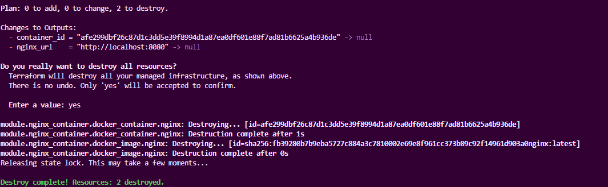
_Vollständige Zerstörung der Infrastruktur. Der Remote State wird entsprechend aktualisiert und reflektiert den leeren Zustand._

### Remote State Workflow

```bash
# State aus Remote Backend lesen
terraform state list

# Plan mit Remote State
terraform plan

# Apply mit Remote State
terraform apply

# State-Informationen anzeigen
terraform show

# Infrastruktur zerstören
terraform destroy
```

### State-Management Best Practices

#### Lokaler vs. Remote State

**Lokaler State (`terraform.tfstate`):**

- Einfach für Entwicklung/Tests
- Nicht teilbar zwischen Team-Mitgliedern
- Gefahr des Datenverlusts
- Keine Versionierung
- Concurrent Access Probleme

**Remote State (Azure Storage):**

- Team-Collaboration möglich
- Automatische Versionierung
- Sicherheit durch Cloud-Storage
- Backup und Recovery
- Zugriffskontrolle

#### State-Isolation

Verwenden Sie unterschiedliche `key`-Werte für verschiedene Umgebungen:

```hcl
# Entwicklung
key = "dev/nginx-iac.tfstate"

# Staging
key = "staging/nginx-iac.tfstate"

# Produktion
key = "prod/nginx-iac.tfstate"
```

### Sicherheitsmaßnahmen

- **Access Keys**: Storage Account mit privaten Zugriffsschlüsseln
- **Container-Isolation**: Private Container ohne öffentlichen Zugriff
- **Verschlüsselung**: Azure Storage Standard-Verschlüsselung aktiviert
- **Versionierung**: Automatische Versionierung für State-Recovery
- **Git-Schutz**: Access Keys niemals in Git-Repository committen
- **RBAC**: Role-Based Access Control für Storage Account

### Troubleshooting Remote State

#### Häufige Probleme

**Problem**: Backend-Initialisierung fehlgeschlagen

```bash
# Lösung: Backend-Cache löschen
rm -rf .terraform/
terraform init
```

**Problem**: Access Key ungültig

```bash
# Lösung: Neuen Access Key generieren
# Azure Portal → Storage Account → Access keys → Regenerate
```

**Problem**: Container nicht gefunden

```bash
# Lösung: Container im Azure Portal erstellen
# Storage Account → Containers → + Container
```

**Problem**: State-Konflikt

```bash
# Lösung: State-Lock prüfen (bei erweiterten Backends)
terraform force-unlock LOCK_ID
```

## Wichtige Befehle

```bash
# Terraform initialisieren (mit Backend)
terraform init

# Backend-Konfiguration ändern
terraform init -reconfigure

# State aus Remote Backend lesen
terraform state list

# State-Details anzeigen
terraform show

# Code formatieren
terraform fmt -recursive

# Konfiguration validieren
terraform validate

# Plan anzeigen
terraform plan

# Änderungen anwenden
terraform apply

# Outputs anzeigen
terraform output

# Infrastruktur zerstören
terraform destroy

# Docker-Container prüfen
docker ps
```

## Docker-Befehle zur Verifikation

```bash
# Laufende Container anzeigen
docker ps

# Container-Logs anzeigen
docker logs nginx-updated-tf

# Container stoppen (manuell)
docker stop nginx-updated-tf

# Container entfernen (manuell)
docker rm nginx-updated-tf
```

## Lernziele erreicht

- **Provider-Konfiguration**: Kreuzwerker Docker Provider v3.0
- **Ressourcen-Management**: Docker Image und Container
- **Variablen**: Konfigurierbare Parameter
- **Outputs**: Wichtige Infrastrukturdaten
- **Locals**: Interne Port-Definition
- **Module**: Wiederverwendbare Container-Konfiguration
- **Remote State**: Azure Storage Backend
- **State Migration**: Lokaler zu Remote State
- **Backend-Konfiguration**: Azure Storage Setup
- **Team-Workflow**: Geteilter State für Collaboration
- **Vollständiger Workflow**: init → plan → apply → destroy

## Problembehandlung

### Port bereits belegt

Falls Port 8080 belegt ist, ändern Sie `external_port` in [`variables.tf`](variables.tf):

```hcl
variable "external_port" {
  default = 8081  # Anderen Port verwenden
}
```

### Docker nicht verfügbar

Stellen Sie sicher, dass Docker Desktop läuft:

```bash
docker --version
docker ps
```

### Provider-Probleme

Bei Provider-Konflikten:

```bash
rm -rf .terraform/
rm .terraform.lock.hcl
terraform init
```

### Azure Backend-Probleme

Bei Remote State Problemen:

```bash
# Backend-Cache löschen
rm -rf .terraform/
rm .terraform.lock.hcl

# Storage Account Access Key prüfen
# Azure Portal → Storage Account → Access keys

# Backend neu konfigurieren
terraform init -reconfigure
```

## Entwicklungs-Workflow

1. **Änderungen vornehmen** in `.tf` Dateien
2. **Formatieren**: `terraform fmt -recursive`
3. **Validieren**: `terraform validate`
4. **Planen**: `terraform plan`
5. **Anwenden**: `terraform apply`
6. **Testen**: Container-Funktionalität prüfen
7. **Committen**: Git-Commit erstellen (ohne [`backend.tf`](backend.tf)!)

## Herausforderungen und Lösungen

### Provider-Konflikte

**Problem**: Doppelte Provider-Konfigurationen  
**Lösung**: Provider nur im Root-Modul definieren

### Port-Konflikte

**Problem**: Port 8000 bereits belegt  
**Lösung**: Standard-Port auf 8080 geändert

### Modul-Struktur

**Problem**: Konsistente Modul-Organisation  
**Lösung**: Klare Trennung von Root- und Modul-Konfiguration

### Remote State Setup

**Problem**: Azure Storage Account Zugriff  
**Lösung**: Access Keys verwenden statt Service Principal

### State Migration

**Problem**: Lokaler State zu Remote Backend  
**Lösung**: `terraform init` erkennt Backend-Änderungen automatisch

### Backend-Konfiguration

**Problem**: Backend-Parameter nicht interpolierbar  
**Lösung**: Nur statische Werte in Backend-Block verwenden

## Nützliche Links

- [Terraform Docker Provider](https://registry.terraform.io/providers/kreuzwerker/docker/latest)
- [Terraform Documentation](https://www.terraform.io/docs)
- [Docker Hub - Nginx](https://hub.docker.com/_/nginx)
- [Terraform Azure Backend](https://www.terraform.io/docs/language/settings/backends/azurerm.html)
- [Azure Storage Documentation](https://docs.microsoft.com/en-us/azure/storage/)
- [Terraform State Management](https://www.terraform.io/docs/language/state/index.html)

## 📄 Lizenz

Dieses Projekt dient Lernzwecken und ist frei verwendbar.

